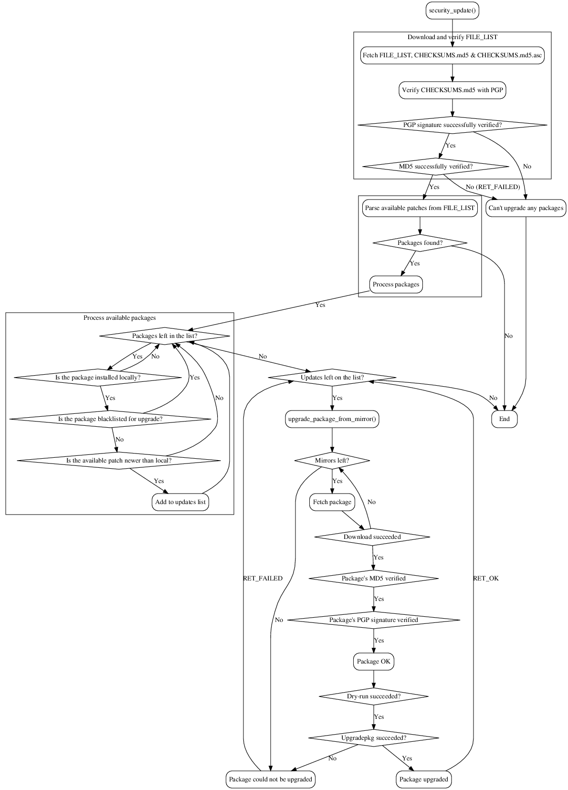

Slackware security patcher (swsp)
=================================

This is a tool to keep your Slackware Linux installation up-to-date with
security patches.

Why?
----

- Well, when I started writing this, there just wasn't any tools to do this
- ...Nowadays there is. But I think my tool is still needed, because it puts
  emphasis on integrity and security in general.
- It's the only tool I use for this task. It's the only tool I trust, because
  I wrote it. And I'm not just being cocky, I'm just paranoid.

Features
--------

- Cycles through several mirrors while trying to download patches. Many times
  the patches have not yet propagated to every mirror when you want to
  install them, so this tries to find the patch on one of the listed mirrors.
- Great emphasis on integrity and verification. Also, the list of available
  patches is verified. I've tried to design and implement this tool in such a
  way, that it would be safe to use also in very hostile environments. No
  guarantees though.
  - Uses the available MD5 and PGP methods to do this
- Tries to guess the SSA ID for the patch in question
- Dry-run mode
- Tests each patch with dry-run before upgrading
- Version and revision comparison for the patches, so if you would happen to
  have a newer version of the software installed on your system, it shouldn't
  work.
- Can print some statistics of the patches installed
- Can list the installed patches in human readable format (from
  /var/log/removed_packages)
- Option to check memory for running processes that might still have old versions of libraries in use ("*-c*")

Notes
-----

- Run this manually. Always. Running something like this from cron, will
  eventually get you compromised. There will always be something that will
  fail, eventually. Do not trust automation when it comes to security.

How it works?
-------------

Here's roughly how it works:

